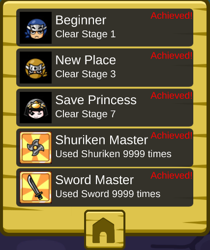

# Kuro_Survival_Achievement
A simple code that will simplify the game for you.
[Kuro Survival](https://store.steampowered.com/app/632200/Kuro_survival/)

set the key configuration as follows:

the code will constantly press the ranged attack keys so you can focus on the close ones.

Even with this, it will be difficult to achieve the achievements, so remember that you can open game cheat ([game cheat](https://www.cheatengine.org)) and search for the value of lives and set it to 1000. You can also modify the attack counter directly to achieve it quickly.
